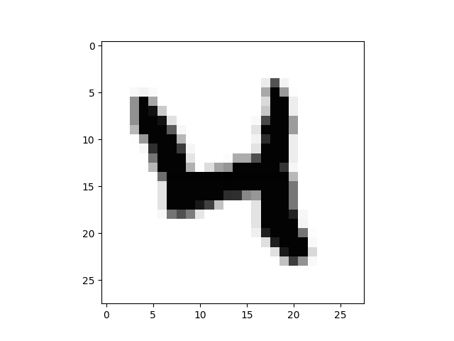

# Detecting of Handwritten Numbers		
The goal of this project is to detect and recognize handwritten numbers by 
applying a multyperceptron (MLP) model.
MLP is a type of feedforward Artificial Neural Network. The learning approach is
supervised and specifically called backpropagation. As the developed network
progresses into different layer(s), error will be computed and propagate into
hidden nodes to improve the signal weights. These signal weights help to output
the handwritten number.
In MLP each node includes an activation function to scale the emerging weights
between the required interval. Input nodes do not posses an activation function, 
as their task is to pass on the input values.
The project's MLP consists of  an input layer, one hidden layer and an output layer.
Activation function of the model is a sigmoid which produces numbers between zero
and one.

The architecture and mathematical justification comes from Tarigh Rashid's great
book named 'Make your Own Neural Network'.

# The activation_class
I have developed this class which gives results in a user-friendly manner. The class
consists of different methods to train the data with a single epoch and
multyepoch. It is also possible to run different models in order to compare 
the performances with different number of hidden nodes, epochs 
and learning rate values. It is simply can be done by printing and instance of the class.
If user needs to run a single model, it is necessary to enter all the arguments in the
construction method. For evaluation of more than one model, required data members 
(model's structure) will be asked to input in the runtime.
Moreover, user can check any records of the training or test dataset and observe the
image of the handwritten number by calling the visualize() method. 

# Datasets
MNIST datasets have been used to test the models. Mentioned datasets can be found from
below link:                                                                             
*http://yann.lecun.com/exdb/mnist/*

A Python module for converting the datasets to csv format can be downloaded from:
*https://pjreddie.com/projects/mnist-in-csv/*
